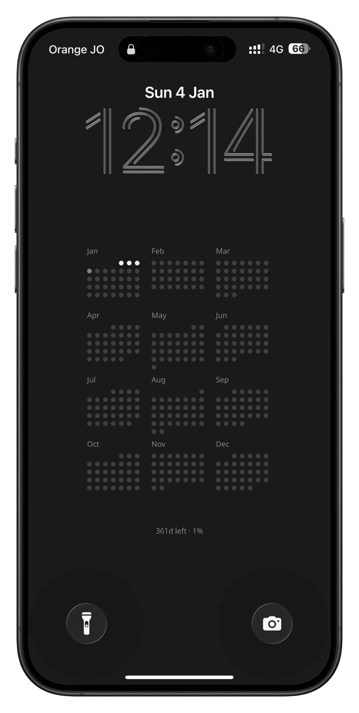

# Chronos

 

**Memento Mori.** Minimalist wallpapers for mindful living.

Visualize your life progress or year at a glance. Generate beautiful, time-aware wallpapers that update automatically on your phone lock screen.

[](https://nextjs.org/)
[](https://vercel.com/)

- **Year View** - Track your current year's progress with a grid of daily dots
- **Life View** - Visualize your entire life as 4,160 weeks in an 80-year timeline
- **Device Support** - Optimized layouts for various smartphone screen sizes
- **Privacy First** - No data storage. Everything generated on-the-fly
- **Dynamic Generation** - Real-time rendering based on your birthdate
- **Edge Runtime** - Fast wallpaper generation using Vercel OG
- And much more...

<p align="center">
  
  &nbsp;&nbsp;
  
</p>

## Tech Stack

- **Framework**: Next.js 16 (Turbopack)
- **Styling**: Tailwind CSS
- **Generation**: Vercel OG Image (Edge Runtime)
- **Deployment**: Vercel

## Running Locally

```bash
npm install
npm run dev
```

Open [http://localhost:3000](http://localhost:3000) to view the application.

---

**Got questions or ideas?** We'd love to hear them! Feel free to open an issue or get in touch.  
**Want to help?** Contributions are welcome! Please open an issue first to discuss what you'd like to change.
