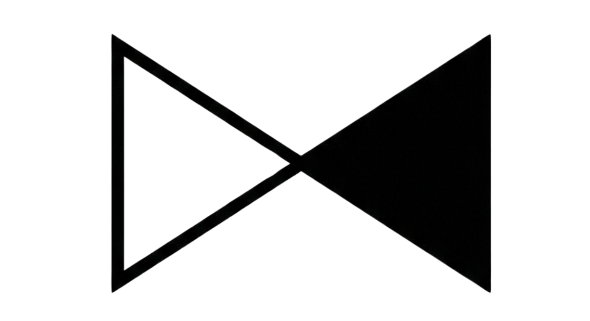

#  Remainders   

 
 
**Memento Mori.** Remember you must die. Your daily reminder to live intentionally.

Visualize your life progress or year at a glance. Generate beautiful, time-aware wallpapers that update automatically on your phone lock screen.

- **Year View** - Track your current year's progress with a grid of daily dots
- **Life View** - Visualize your entire life as 4,160 weeks in an 80-year timeline
- **Device Support** - Optimized layouts for various smartphone screen sizes
- **Privacy First** - No data storage. Everything generated on-the-fly
- **Dynamic Generation** - Real-time rendering based on your birthdate
- **Edge Runtime** - Fast wallpaper generation using Vercel OG
- And much more...

 
 

---

**Got questions or ideas?** We'd love to hear them! Feel free to open an issue or get in touch.  **Want to help?** Contributions are welcome! Please open an issue first to discuss what you'd like to change.
